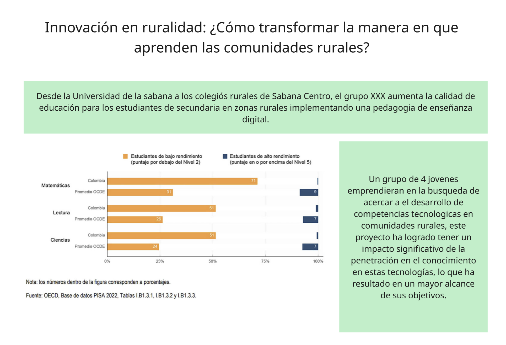

# Proceso de diseño

## **1. Evaluación de la situación**

### **1.1 KnoWonder**

| KNOW | WONDER |
| :-------------------------------------------------------------------------------------------------------------------------------------------------------------------------------- | :----------------------------------------------------------------------------------------------------------------------------------------------------------------------------------------------------------------------------------------------------------------------------------------------------------------------------------------------------------------------------- |
| Es un problema que afecta a estudiantes y profesores y padres                                                                                                                    | En que medida los padres influencian en esta problematica.                                                                                                                                                                                                                                                                                                                 |
| Los profesores tienen un papel casi tan importante como los estudiantes                                                                                                          | Quien es el principal decisor de esta situación.                                                                                                                                                                                                                                                                                                                           |
| Según las pruebas piza nuestro nivel de educacion ha bajado                                                                                                                      | Como la presión social afecta a la mentalidad y desempeño de los estudiantes                                                                                                                                                                                                                                                                                               |
| Se han hecho varias iniciativas que no sirven                                                                                                                                    | ¿En qué medida el contexto socioeconómico familiar limita el acceso y éxito escolar de los estudiantes?                                                                                                                                                                                                                                                                     |
| Dar tecnologia sin capacitacion o un plan no sirve.                                                                                                                               | ¿Cómo se puede fomentar la participación activa de los padres en comunidades rurales con altos niveles de migración o empleo informal?                                                                                                                                                                                                                                      |
| Dar tecnologia sin coneccion no sirve                                                                                                                                             | ¿De qué modo las comunidades rurales pueden co-crear soluciones adaptadas a sus necesidades educativas sin depender solo del gobierno central?                                                                                                                                                                                                                               |
| Resolver problemas de conexión sin emancipación no sirve.                                                                                                                         | ¿De qué manera la falta de infraestructura tecnológica afecta la motivación y el aprendizaje de los estudiantes?                                                                                                                                                                                                                                                             |
| Se necesita de un plan de integración que tenga en cuenta tanto la participación de todas las partes, profesores, estudiantes, padres de familia, ademas que incluya participacion activa de todas estas en conjunto con un plan de acción, de esta forma se ataja de manera efectiva el problema de la calidad de educación. |                                                                                                                                                                                                                                                                                                                                                                                            |
| La solución deberia siempre ser aplicada, es decir, cambiar la forma en la que se enseña, adaptar una nueva metodologia para siempre.                                             |                                                                                                                                                                                                                                                                                                                                                                          |

***
***
### **1.2 5W1H**
| Opciones | Gio | Santiago | Joao | John | Total |
| :--- | :--- | :--- | :--- | :--- | :--- |
| IA agent que se ajuste a cada estudiante y tema | 2 | 4 | 3 | 1 | 10 |
| La solución implementa la investigación con IA | 1 | 4 | 2 | 1 | 8 |
| Profesor que se ayude de insights que da el AI agent de cada estudiante | 3 | 5 | 3 | 1 | 12 |
| La solución contiene una metodología de enseñanza y aprendizaje | 5 | 2 | 4 | 3 | 14 |
| La solución necesita un proceso específico de implementación | 5 | 3 | 3 | 1 | 12 |
| La solución es fácil de usar | 5 | 4 | 5 | 1 | 15 |
| Darles internet y un AI agent. * | 2 | 5 | 2 | 5 | 14 |
| La solución Tiene un componente físico | 5 | 4 | 1 | 2 | 12 |
| Un duolingo para educación | 5 | 4 | 5 | 5 | 19

## **2. Clarificación**
### _2.1 Exploración de la visión_

#### Periodismo Investigativo

#### Taller de sueño
Excursion mental, soñar el futuro y el exito del proyecto, posibles consecuencias y beneficios.

A quienes observamos, que sentimos, que podemos ver, en esta excursión:

1. Felicidad
2. Curiosidad
3. Niños aprendiendo
4. Niños obteniendo nuevas oportunidades
5. Premio Nobel
6. Premio titanes caracol
7. Ampliar el proyecto en otras zonas

#### Pensamiento anhelante

Transformación de los malos anhelos en oportunidades.

### _2.2 Formulación de desafios_

Como [oportunidad] [Actor] [Acción].

*Problematica: ¿Cómo podríamos facilitar que estudiantes de primaria y secundaria en colegios de municipios rurales desarrollen competencias de aprendizaje digital?*

- ¿Cómo podríamos facilitar que estudiantes de primaria y secundaria en colegios de municipios rurales desarrollen competencias de aprendizaje digital?

- ¿Como podríamos hacer que los estudiantes aprendan más?

- ¿Como podríamos financiar el proyecto?

- ¿Como podríamos capacitar a los profesores para que entiendan la tecnología?

- ¿De que manera daríamos mantenimiento a la infraestructura del proyecto?

- ¿Como podemos nosotros implementar de manera suave la solción?

- ¿De que manera los profesores usan la infraestructura?

- ¿De que manera los estudiantes usan la infraestructura?

- ¿Como nosotros podemos proporcional el material digital necesarió tanto para profesores y estudiantes?

- ¿De que manera podemos dar una solución que sea reusable por los mismos colegiós luego de su implementación?

## _3. Transformación_
### _Exploración de ideas_
### _Formulación de Soluciones_

## _4. Implementación_
### _Exploración de aprobaciones_
### _Formulación de un plan_
